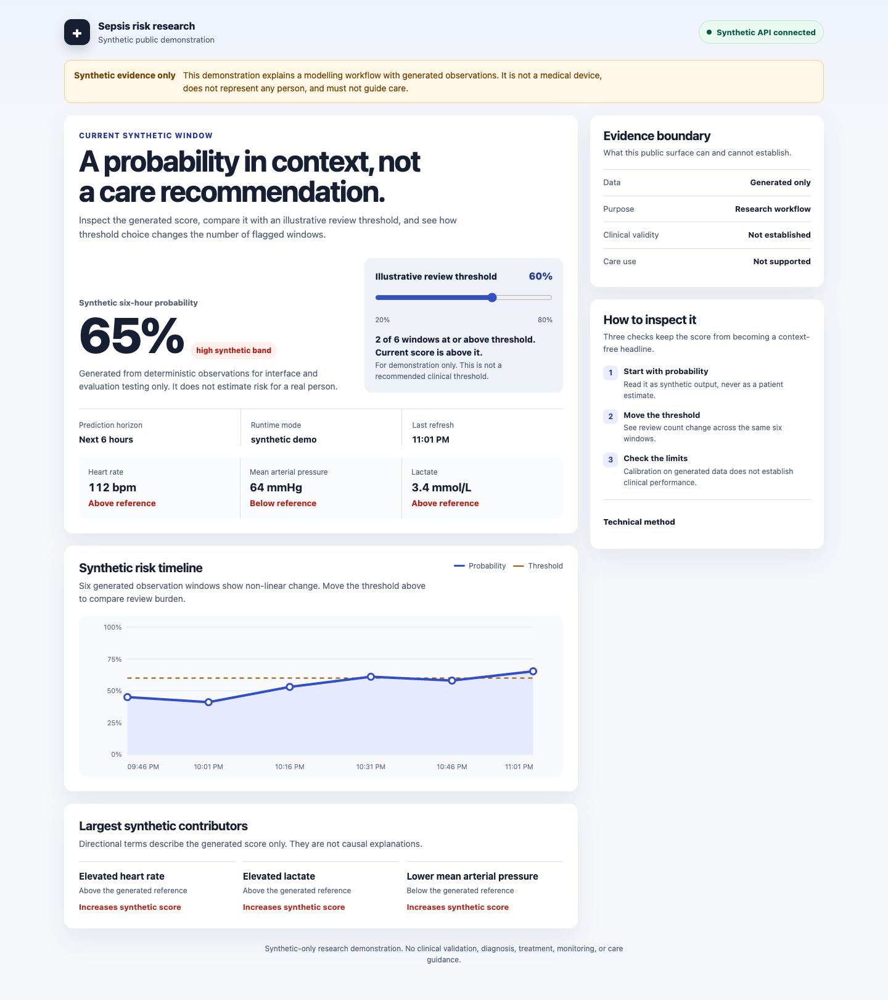
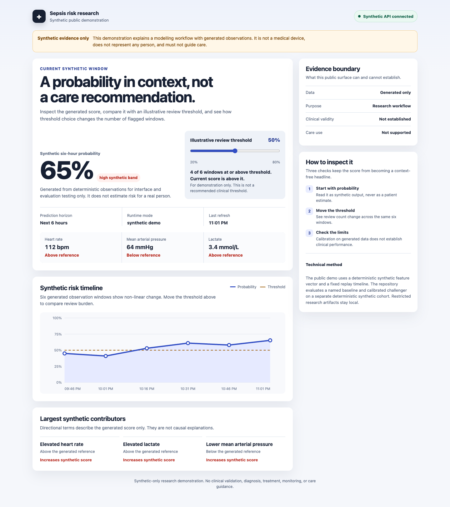
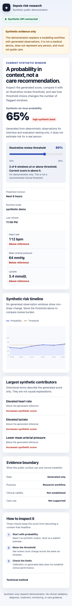
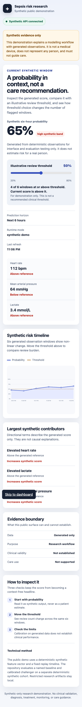

# Synthetic Sepsis Risk Research Demo

An educational research project for studying risk-model evaluation and calibration on deterministic synthetic data. The public dashboard and evaluation contain no MIMIC data, patient records, or patient-level derivatives.

This project is not validated for clinical use. It does not provide clinical guidance and must not be used for patient care.

[Open the live synthetic dashboard](https://sepsisriskdemo-api.lemonfield-be5cc375.eastus2.azurecontainerapps.io/)

## What it does

- A synthetic risk timeline with transparent input and status context.
- A prevalence-only baseline compared with a calibrated model on a fixed synthetic holdout.
- Calibration, threshold sensitivity, positive predictive value, and alert-count evidence with limitations beside the results.
- Explicit loading, empty, and error states for reviewing the dashboard behavior.

The demo is a research interface, not a clinical workflow. Its risk values and alert counts describe synthetic rows only.

## Dashboard evidence

| Stakeholder view at 1440px | Technical evidence view at 1440px |
| --- | --- |
|  |  |

| Stakeholder view at 390px | Technical evidence view at 390px |
| --- | --- |
|  |  |

Headless Chrome verification found zero horizontal overflow at both widths and zero automated WCAG A or AA violations. Manual keyboard checks covered the threshold control, method disclosure, loading, empty, error, and retry states.

## Architecture

The public path is `deterministic synthetic fixture -> reproducible evaluation -> Flask API -> synthetic timeline dashboard`. The optional local research path reads owner-obtained data outside Git and writes ignored local artifacts. It is not part of the public dashboard or evaluation.

See [`docs/architecture.md`](docs/architecture.md) for component boundaries, failure behavior, and the live scale-to-zero topology.

## Evaluation

### Reproduce the synthetic evidence

Python 3.12 and [uv](https://docs.astral.sh/uv/) are required.

```bash
uv sync --frozen --extra dev
uv run python -m scripts.evaluate_synthetic --output evidence/synthetic-baseline-v1.json
uv run pytest -q
uv run ruff check .
uv run mypy src
```

The evaluation uses a seeded 1,200-row synthetic fixture, a stratified 75/25 holdout, a prevalence-only baseline, and the calibrated challenger. It records AUROC, AUPRC, Brier score, fixed 10-bin expected calibration error, and threshold results at 0.10, 0.20, and 0.50.

On this deterministic synthetic fixture, the calibrated model improves discrimination and Brier score over the prevalence-only baseline. These results do not estimate patient, clinical, deployment, or care performance. See [`evidence/synthetic-baseline-v1.json`](evidence/synthetic-baseline-v1.json) for the versioned result and method.

| Synthetic holdout metric | Prevalence-only baseline | Calibrated model | Direction |
| --- | ---: | ---: | --- |
| AUROC | 0.5000 | 0.9796 | Higher |
| AUPRC | 0.0500 | 0.7472 | Higher |
| Brier score | 0.0475 | 0.0228 | Lower |
| Fixed 10-bin ECE | 0.0000 | 0.0205 | Lower |

The baseline ECE is zero because its constant 5% prediction exactly matches the stratified holdout prevalence. That does not imply discrimination or usefulness.

| Synthetic threshold | Sensitivity | Positive predictive value | Alert rows per 100 |
| ---: | ---: | ---: | ---: |
| 0.10 | 0.9333 | 0.3333 | 14.0 |
| 0.20 | 0.8667 | 0.5000 | 8.7 |
| 0.50 | 0.5333 | 0.6667 | 4.0 |

## Run the dashboard locally

```bash
uv sync --frozen
uv run flask --app src.app run
```

Open `http://localhost:5000`. The default path uses only built-in synthetic values. To exercise the local model path, first create the ignored smoke-test model:

```bash
uv sync --frozen
uv run python -m scripts.train_synthetic
ALLOW_LOCAL_RESEARCH_MODEL=1 MODEL_PATH="$PWD/artifacts/synthetic-model.joblib" uv run flask --app src.app run
```

## API

- `GET /healthz` returns service health and the active synthetic or local-model mode.
- `GET /v1/demo/timeline/{synthetic_id}` returns a synthetic replay timeline.
- `POST /v1/score` validates the feature payload and returns a synthetic research score, band, input drivers, mode, and safety disclaimer.

## Data boundary

Only source code, deterministic synthetic fixtures, and aggregate synthetic evaluation evidence belong in the public repository. The following stay local and are excluded from Git and Docker build context:

- MIMIC files and any credentialed source data.
- Patient-level or encounter-level derivatives.
- Feature tables, trained models, metrics from patient data, MLflow runs, and SHAP exports.
- Delivery state, credentials, generated dependency graphs, and local tooling artifacts.

The optional local research workflow expects an owner-obtained MIMIC-IV Demo download under `data/mimic-iv-demo/` and a separately reviewed onset file. MIMIC access and use remain governed by PhysioNet terms. No MIMIC files are required to run or evaluate the public synthetic demo.

## Limits

- The synthetic labels are derived from same-time synthetic features and have no patient or temporal structure.
- The evidence has no clinical cohort, external validation, subgroup analysis, or confidence intervals.
- Alert counts are per synthetic row and do not model suppression, cooldown, staffing, or workflow consequences.
- The project does not establish clinical validity, clinical utility, safety, generalizability, or deployment readiness.

## Scaling

The live synthetic surface runs as one Azure Container App with zero minimum replicas and a public, source-linked container image. The deployment adds no patient data, model artifact, storage account, paid registry, or monitoring workspace. No load, availability, or sustained-cost evidence exists, and the app may cold start after scaling to zero.

## Deployment status

The [live HTTPS demo](https://sepsisriskdemo-api.lemonfield-be5cc375.eastus2.azurecontainerapps.io/) was verified on August 17, 2026 through its health, timeline, and synthetic scoring endpoints. Azure reports the configured image, zero minimum replicas, two maximum replicas, and a succeeded provisioning state. The demo is a small permanent research surface, not a production or clinical service.

## License

Source code is available under the [MIT License](LICENSE). No dataset is distributed under that license.
